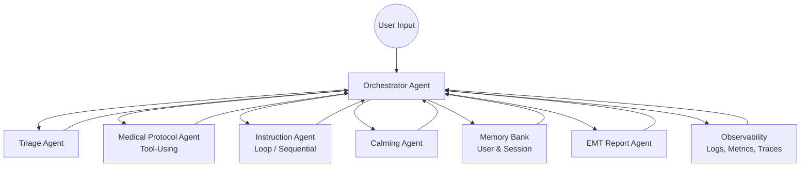

# 🆘 **LifeSaver: Real-Time Multi-Agent Emergency Response Assistant**
---

## 🚨 **Overview**

**LifeSaver** is a **multi-agent, tool-using, session-aware emergency guidance system** that helps users respond calmly and correctly during real-life emergencies such as choking, anaphylaxis, stroke symptoms, cardiac arrest, or unconsciousness.

When the user describes an emergency in natural language (e.g., *“my dad isn’t breathing”*), LifeSaver:

1. **Identifies the emergency type**
2. **Fetches medically grounded step-by-step instructions**
3. **Guides the user through actions in real-time**
4. **Maintains a long-running session** until emergency responders arrive
5. **Generates an EMT-ready incident report** summarizing symptoms, timestamps, and actions taken

LifeSaver transforms chaotic, panicked moments into **guided, structured action**.

---

# 🧩 **Motivation**

During medical emergencies, people lose precious time:

* Panic overwhelms reasoning
* Google results are scattered, unsafe, or incomplete
* Instructions are not adapted to real-time user feedback
* Even trained individuals forget the order of critical steps under stress

**LifeSaver bridges this gap by giving rapid, personalized, medically aligned guidance** powered by AI agents, custom tools, memory, and long-running operations.

This project is inspired by publicly accessible best-practice medical guidelines (CDC, Red Cross) and serves as an educational and technical demonstration — **NOT a medical device**.

---

# 🤖 **System Architecture**

LifeSaver is a **coordinated multi-agent system** where each agent fulfills a distinct responsibility.
The agents communicate through a central **Orchestrator**.

### **Architecture Diagram (Mermaid)**


---

# 🛠 **Key Features Demonstrated**

This project intentionally showcases **all core concepts** taught in the Google AI Agents Intensive:

## ✔ **1. Multi-Agent System**

* **Triage Agent** – classifies emergency type
* **Medical Protocol Tool Agent** – retrieves validated procedures
* **Instruction Agent** – real-time sequential guidance
* **Calming Agent** – reduces panic and keeps user centered
* **EMT Report Agent** – compiles structured incident reports
* **Orchestrator** – coordinates transitions between agents

## ✔ **2. Tool Use**

* Custom tool: `get_protocol(emergency_type)`
* Returns: structured steps, precautions, contraindications
* Optional: search tool for additional context

## ✔ **3. Sessions & Long-Term Memory**

* Session ID persists through entire emergency
* Memory stores:

  * Preferred language
  * Whether user knows CPR
  * Family-specific details (e.g., “my mom has asthma”)

## ✔ **4. Long-Running Operations**

* Instruction Agent uses a **loop** until emergency is resolved
* Supports pause & resume
* Session remains active across messages

## ✔ **5. Observability**

* Logs:

  * Emergency classification
  * Tool calls
  * Step progression
  * User confirmations
* Metrics:

  * Step completion count
  * Conversation length
  * Repeated clarification requests

## ✔ **6. Agent Evaluation**

* Includes an evaluation suite with simulated scenarios:

  * “Adult choking with partial airway obstruction”
  * “Stroke symptoms described by family member”
  * “Child unconscious but breathing”
* Evaluates:

  * Classification accuracy
  * Correctness of recommended steps
  * Safety adherence

## ✔ **7. Deployment (Cloud Run)**

* Containerized service
* HTTP /chat endpoint
* Documentation included for reproduction

## ✔ **8. Gemini Integration**

Gemini is used as the LLM behind all major reasoning agents.

---

# 🧠 **Detailed Agent Descriptions**

### 🔍 **1. Triage Agent**

* Parses user input into structured emergency representation
* Uses schema: emergency_type, severity, key symptoms
* Examples:

  * “Not breathing” → cardiac arrest
  * “Swollen lips + difficulty breathing” → anaphylaxis

---

### 🩺 **2. Medical Protocol Agent (Tool Agent)**

Custom tool:

```
get_protocol(emergency_type: str) -> EmergencyProtocol
```

Sources:

* Curated emergency procedures inspired by educational materials
* Red Cross CPR steps
* First aid guidelines

Outputs:

* Steps[] (ordered)
* Conditions (`if no pulse`, `if choking worsens`)
* Stop conditions (`when EMT arrives`)

---

### 🗣 **3. Instruction Agent (Looping Agent)**

* Sequentially delivers steps
* Waits for confirmation before moving on
* Adjusts instructions based on user’s replies
* Maintains emotional calmness and clarity

---

### 😌 **4. Calming Agent**

* Injects brief grounding cues
* Helps user breathe and stay focused
* “You’re doing great — continue compressions at this pace.”

---

### 📄 **5. EMT Report Agent**

* Summarizes:

  * Timeline
  * Symptoms described
  * Actions taken
  * Medications used (e.g., epi-pen if user mentions it)
* Output: JSON + natural-language report

---

# 📁 **Project Structure**

```plaintext
lifesaver-emergency-agent/
├─ README.md
├─ requirements.txt
├─ src/
│  ├─ orchestrator.py
│  ├─ agents/
│  │  ├─ triage_agent.py
│  │  ├─ instruction_agent.py
│  │  ├─ calming_agent.py
│  │  ├─ emt_report_agent.py
│  ├─ tools/
│  │  ├─ protocol.py
│  ├─ eval/
│  │  ├─ eval_scenarios.json
│  │  ├─ run_eval.py
```

---

# 🧪 **Evaluation Framework**

LifeSaver includes a lightweight evaluative pipeline to test:

* Emergency classification quality
* Step ordering correctness
* Safety: No hallucinated medical treatments
* Stability of long-running sessions

Example scenario in `eval_scenarios.json`:

```json
{
  "id": "stroke_01",
  "input": "My mom suddenly can't speak and one side of her face is drooping.",
  "expected_emergency_type": "possible_stroke",
  "expected_actions_include": [
    "Call emergency services immediately",
    "Check FAST symptoms"
  ]
}
```

---

# 🚀 **Deployment Instructions**

A full Cloud Run deploy path is described in the docs:

### Build container:

```bash
gcloud builds submit --tag gcr.io/<project-id>/lifesaver
```

### Deploy:

```bash
gcloud run deploy lifesaver \
  --image gcr.io/<project-id>/lifesaver \
  --platform managed \
  --region us-central1 \
  --allow-unauthenticated
```

### API Usage:

```bash
curl -X POST https://<cloud-run-url>/chat \
  -H "Content-Type: application/json" \
  -d '{"message": "My dad collapsed and is not breathing"}'
```

---

# ⚠️ Disclaimer (Important for Safety)

This project is an **educational demonstration**, not a medical device.
It does **not** replace professional medical advice or emergency services.

---

# ⭐ **Future Work**

* Mobile-friendly interface
* Connection to wearables (heart rate, fall detection)
* Multilingual support
* Auto-escalation (call emergency services triggers with user consent)
* Integration with audio input for hands-free emergency mode

---

## 👥 Contributors

- **Julisa Delfin** – MS Data Science, DePaul University
[](https://www.linkedin.com/in/julisadelfin/)  
